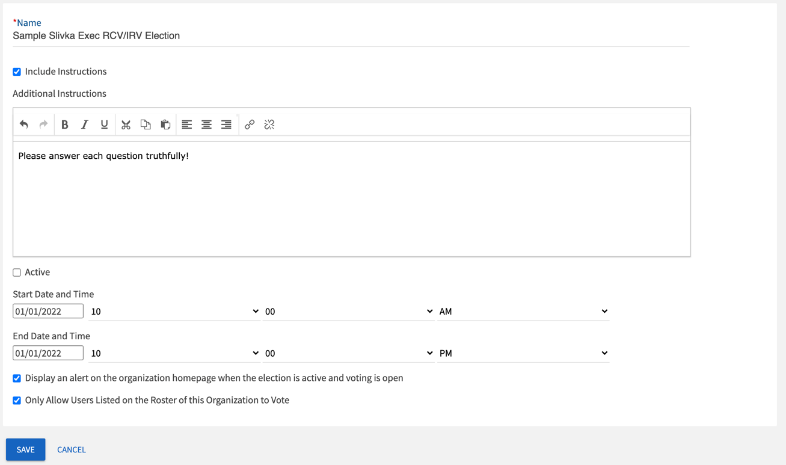
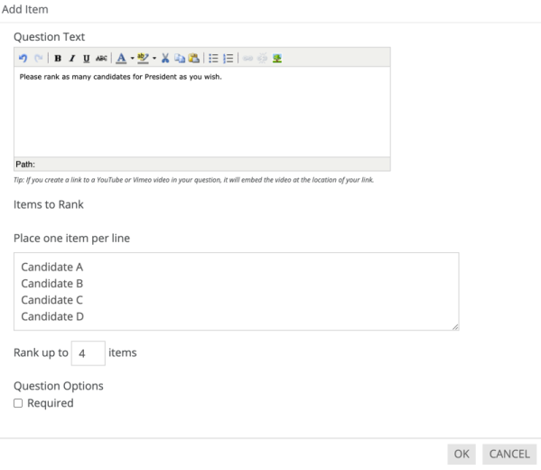

# Instructions for Creating a Wildcat Connection Election
These instructions are specific to Slivka Executive Committee election procedures, and mention specific Slivka positions.
However, the process is the essentially the same for any organization; simply modify the question option and names to fit your needs.

## Part 0: Administrator
You must be an administrator for Slivka on Wildcat Connection.
You should already be one if you are Assistant Chair.
If you are not Assistant Chair, please contact the Assistant Chair to assign you as an admin.

## Part 1: Creating a ballot
This section should be completed as soon as all candidates are known.

1. Navigate to the Slivka Wildcat Connection homepage and click on _Manage Organization_ near the top left corner.
2. Click on the menu icon next to the words _Slivka Hall_ near the top left of the page, and the within the menu click on _Elections_
3. Click on _Create Election_ near the top right of the page.

4. Give the election a name and short description.
Give a _Start Date and Time_ a week before the election, and an _End Date and time_ a week after the election.
Check all boxes **except for _Active_**.
Click _Save_
5. You should immediately be directed to the _Ballots_ tab within the election menu.
Click on _Create Ballot_ on the right.
<!--  -->
6. Give the ballot an appropriate name, and make sure _General Access_ is _Enabled_.
Click _Save_.

7. In this ballot, create a ranked question for each elected exec position in the order of succession. This order is President, Vice President, Treasurer, Academic Chair, Fellows Chair, Social Chair, Philanthropy Chair, Facilities Chair, Information Technology Chair, and Publications Chair.
    - Under _Add New ..._ within the ballot page, select _Ranking_.
    - Under _Question Text_, wrie a short question for the ballot.
    **Be sure to explicitly mention the position in the question.**
    - Under _Item to Rank_, list the name of each candidate in speech order (i.e. reverse order of acceptance of nomination).
    Make sure the value in _Rank up \_\_ items_ is equal to the number of candidates.
    - Leave _Required_ unchecked.
    - Click _Ok_.

## Part 2: Holding the Election and Exporting Votes
This section should be completed on the day of the election.
1. Navigate to the Slivka Wildcat Connection homepage and click on _Manage Organization_ near the top right corner.
2. Click on the menu icon next to the words _Slivka Hall_ near the top left of the page, then within the menu click on _Elections_.
3. Click on your election on the elections page.
4. You should immediately be directed to the _Properties_ tab within the election menu.
Toggle the _Election Stats_ to _Active_.
Click _Save_ on the bottom of the page.
5. Click on your election on the elections page.
6. Navigate to the _Publishing Options_ tab on the election menu.
Copy the _Election Link_ and send it to the SLIVKA Listserv once all candidates have spoken.
7. Once the election has been completed, go to the _Properties_ tab within the election menu and toggle the _Election Status_ to _Inactive_.
Click _Save_ on the bottom of the page.
8. Click on your election in the elections page.
9. Navigate to the _Results_ tab on the election menu.
Click on _Export all Votes_ near the top right of the page.
10. You should receive an email within a few minutes with a link to the results.
Go to this email and click on View Downloads.
11. You should be directed back to a Wildcat Connection page.
Download the latest CSV file.
